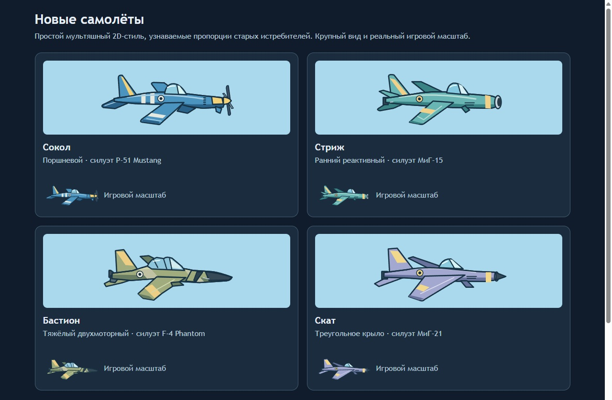

# Бипланы / Biplanes

Браузерная 2D-аркада для Яндекс Игр: воздушные дуэли 1×1 и кампания из 250 операций с короткими вылетами. Текущая сборка **v0.9.0** от 3 октября 2026 года использует TypeScript, Phaser и отдельный авторитетный сервер Node.js.

Рабочий прототип содержит оба режима, серверную экономику, ангар, задачи и новые мультяшные самолёты. Проект в Консоли Яндекс Игр ещё не создан; реальные покупки и публикация не подключены.

## Утверждённые самолёты в игре

Пять пропеллерных моделей доступны в ангаре и обоих режимах. «Сокол» — стартовый; «Стриж» стоит 2500 серебра после босса 25; «Янтарь» — 12000 серебра после босса 100; двухмоторный «Рубин» — 30000 серебра после босса 200. Для следующего бесплатного самолёта также нужно купить все 15 ступеней корпуса, двигателя и оружия предыдущего. «Феникс» доступен с самого начала за 300 золота: его база равна «Стрижу» — 175 HP, скорость 210, поворот 3,1 и урон пули 18. Его три ветки развиваются отдельными золотыми деталями после боссов, без XP и серебра. Финальные детали дают 800 HP, скорость 310, поворот 5 и урон 86.

Сохранённые `bastion` и `skate` соответствуют «Рубину» и «Фениксу»: старые покупки сохраняются; оплаченная сила прежнего Феникса переносится однократно в детали и сохранённый минимум характеристик. Охлаждение в пикировании остаётся. Старые SVG и архивные кадры относятся к предыдущему визуалу; история изменений сохранена в Git.

Корпуса без нарисованных лопастей находятся в `public/art/approved/`. Рендер обрезает прозрачные поля и постепенно уменьшает текстуры; три лопасти каждого винта анимируются отдельно перед наложением корпуса. У «Феникса» две золотые полосы и движущиеся искры. Повороты и зеркальное отображение распространяются на эффекты; пауза останавливает анимацию. Противники тоже используют пропеллерные корпуса.

[Единая страница моделей](http://127.0.0.1:5222/models.html) показывает пять самолётов игрока, противников карьеры и дуэли, три уникальных самолёта боссов, ПВО и отдельные кадры шести наземных препятствий. Внизу — проверка форсажа тем же `SkyScene`, без изменения профилей. Все прежние страницы визуальной проверки удалены. История утверждения и исходники сохранены в `design-review/propeller-approval/`.

Реализованы 250 операций, 11 боссов и восемь новых регионов после 50-го: пролив, каньоны, полярный путь, пустоши, перевал, архипелаг, багровый горизонт и небесный рубеж. Ранее предложенный маршрут на 900 участков и новые зоны сохранён в [геймдизайне](game-design-document.html#long-career) как будущий концепт. Его прежние оценки времени и открытия самолётов не относятся к v0.9 и требуют пересчёта.


Противники карьеры имеют собственные корпуса: оливковый биплан и сине-жёлтый двухмоторный тяжёлый самолёт. Боссы уровней 10, 25 и 50 используют соответственно синий гоночный биплан, алый перехватчик с крылом «чайка» и четырёхмоторную крепость. Самолёты в бою уменьшены до масштаба 0,32 для игрока и бота дуэли; боссы используют масштаб 0,5; ангар сохраняет крупные портреты. Бот дуэли случайно выбирает модель ангара из соседних ступеней прогрессии. Его решения обновляются раз в 250–300 мс, прицел имеет воспроизводимую ошибку ±10°, огонь идёт очередями 0,55–0,85 секунды с паузами 0,4–0,65 секунды. Уход от земли остаётся немедленным. Золотая модель доступна боту только против золотой модели игрока. Прочность, скорость, поворот и урон отличаются от улучшенного самолёта игрока не больше чем на 10%; форсаж и охлаждение совпадают. PNG находятся в `public/art/approved/`; промпты встроенного ImageGen — `enemy-generation.json`. Винты рисуются и вращаются отдельно в Canvas.

## Прогрессия и ресурсы

Три ресурса: серебро (`#bdcedf`), золото (`#ffd080`) и опыт (`#9bdccb`). Цвет одинаков в кошельке, задачах, ценах и итогах боя. Опыт — расходуемый баланс; суммарно полученный `totalXp` отдельно сохраняет ранг для подбора дуэлей.

Покупка самолёта проверяет подтверждённую сервером победу в `defeatedBosses`, полный комплект 15/15/15 предыдущего бесплатного корпуса и остаток ресурса. Пороги: босс 25 → Стриж после Сокола; 100 → Янтарь после Стрижа; 200 → Рубин после Янтаря. Для покупки Феникса нужен только остаток 300 золота; прогресс кампании ограничивает его следующие детали, а не покупку корпуса. Ранг не заменяет эти условия. Все этапы рассчитаны на бесплатную последовательность Сокол → Стриж → Янтарь → Рубин; премиум и платный самолёт не требуются. Старые приобретения остаются доступными.

У каждой из четырёх бесплатных моделей три ветки по **15 ступеней**. Следующая ступень сначала исследуется за XP, затем покупается за серебро; исследование сохраняется, но само не повышает характеристики. Базовая последовательность XP: 20 / 25 / 30 / 35 / 40 / 45 / 50 / 55 / 60 / 65 / 70 / 75 / 75 / 75 / 80. Серебро: 65 / 80 / 95 / 110 / 125 / 145 / 160 / 175 / 190 / 205 / 220 / 240 / 240 / 240 / 250. Для Сокола применяется множитель 1, Стрижа — 18, Янтаря — 50, Рубина — 38. Цена отдельной ступени растёт плавно; последние покупки не имеют прежнего резкого скачка.

Полная покупка трёх веток, сверх цены самолёта и модулей:

- Сокол: 2400 XP и 7620 серебра.
- Стриж: 43200 XP и 137160 серебра.
- Янтарь: 120000 XP и 381000 серебра.
- Рубин: 91200 XP и 289560 серебра.

Корпус и оружие дают +2% базы за ступень; двигатель — +0,667% скорости и +0,333% поворота. Полный максимум прежний: +30% HP и урона, +10% скорости, +5% поворота. При миграции `progressionVersion: 2` старые купленные и исследованные ступени 0–5 переводятся в 0–15 умножением на три; повторная загрузка не умножает их снова. Купленные самолёты и ресурсы сохраняются. Обе операции покупки/исследования сохраняются атомарно и защищены от повтора запроса.

«Феникс» имеет отдельные ветки корпуса, двигателя и оружия по **6 деталей**. Для каждой ветки цены — 30 / 45 / 60 / 80 / 100 / 140 золота, условия — победы над боссами 25 / 50 / 100 / 150 / 200 / 225 соответственно. В сумме 18 деталей стоят 1365 золота; корпус вместе с полным комплектом — 1665. Двигатель одновременно меняет скорость и поворот. Сила полных комплектов по ступеням соответствует максимальному Стрижу, базовому Янтарю, максимальному Янтарю, базовому Рубину, максимальному Рубину и финалу 800 HP / 86 урона. Детали покупаются последовательно; повтор не списывает золото. Обычные исследования и серебряные улучшения Фениксу недоступны. Старый купленный Феникс получает 6/6/6 и минимум своих прежних оплаченных характеристик, даже если они выше нового финала; кошелёк не меняется. Профиль, который раньше не владел Фениксом, получает новую базовую модель без наследования таких бонусов.

Оснащение покупается **отдельно для каждой модели**: карбюратор и радиатор стоят по 120 золота каждый, один модуль активен в её собственном слоте. Карбюратор увеличивает форсаж с 2 до 3 секунд, сохраняя восстановление 6 секунд; радиатор даёт +35% охлаждения без уменьшения урона. Смена модели сохраняет её выбор. При миграции прежние общие покупки выдаются только уже купленным самолётам; следующие покупки не наследуют оснащение.

Перед боссом полёт останавливается: карточка показывает его самолёт, характеристики и попытку. Можно сразу начать бой или перейти в ангар, прокачаться и вернуться через «К боссу». Выход в ангар не расходует попытку. Первые этапы: 1–10, 11–25, 26–50. После 50-го этапы занимают по 25 уровней, боссы стоят на 75/100/125/150/175/200/225/250. Границы вычисляются по конфигурации зоны. Старый завершённый маршрут из 50 уровней продолжается с 51-го; ожидающий выбор последней карточки также сохраняется.

Столкновение с боссом вне активного фазового прохода сразу завершает попытку поражением игрока независимо от HP, щита и защиты от повторного тарана; босс не получает урон от такого столкновения. Каждый босс допускает три попытки, включая первый бой. Первая и вторая смерть позволяют повторить босса, третья возвращает к началу его этапа: 10 → 1, 25 → 11, 50 → 26. Пауза и выход сохраняют бой и попытку; повторный запуск не восстанавливает здоровье сохранённого босса. Ресурсы, покупки, исследования, открытые самолёты и модификаторы при откате остаются.

После каждой победы над боссом, в том числе повторной, выбирается одна постоянная карточка. 12 модификаторов четырёх редкостей относятся ко всему профилю и работают на любом самолёте в кампании. Среди эффектов: +20% прочности, +20% урона, тройной залп, автоматическая ракета каждые 10 секунд с приоритетом ПВО, ремонт, охлаждение и пробивающие пули. Выбор сохраняется сервером, его нельзя заменить. Пока остаются новые карточки, дубликаты не предлагаются; после сбора всех 12 выдаются улучшения имеющихся. Последние одна или две новые карточки предлагаются без заполнения дубликатами. Меню «Модификаторы» открывается на вкладке «Мои»; каталог показывает все доступные эффекты отдельно. Редкости различаются цветом и обозначением.

Опыт и серебро боевых наград кампании делятся на два с округлением до целого. Уничтожения оплачиваются сразу; успешный вылет имеет минимальный общий доход, в который уже полученные награды уничтожений входят. При завершении сервер доплачивает только недостающую сумму, ничего не отнимая. Доход сверх минимума остаётся бонусом. После деления базовые гарантии на вылет: 1–25 — 120 серебра / 40 XP; 26–100 — 340 / 100; 101–200 — 540 / 160; 201–250 — 740 / 230. Отдельный бонус завершения операции — 90 / 40; босс также выдаёт отдельную награду. Премиум даёт +50% после половинной базы и одинаково учитывается в немедленных выплатах и гарантии. Награды дуэлей и задач не уменьшены.

## Кампания v0.9: короткие сессии и долгий маршрут

Каждый уровень — операция из нескольких коротких вылетов. Вылет завершается после минимального времени и выполнения задачи: одного быстрого пролёта недостаточно. Первые 1–3 операции содержат по одному вылету на 45 секунд; 4–10 — по два на 90 секунд; 11–25 — по четыре; 26–100 — по шесть; 101–250 — по восемь. Форсаж меняет полёт, но не сокращает обязательное время задания.

Семь видов миссий: перехват истребителей, подавление ПВО, охота на тяжёлый конвой, воздушный патруль, разведка через светящиеся кольца, сбор ремонтных контейнеров и уничтожение командира звена с золотой меткой. Это отдельные цели в симуляции. Между вылетами можно вернуться в ангар; завершённые вылеты операции сохраняются. Перед каждым следующим вылетом самолёт ремонтируется до 100%.

С 4-й операции в боевых миссиях появляются верхние бомбардировщики; в разведке и снабжении их нет. До 26-й операции в группе один самолёт, на 26–100 — два, с 101-й — три. Сброс предваряет предупреждение минимум 1,5 секунды; бомбы падают со скоростью 100–120 единиц мира/с. До 51-й операции сбрасывается одна бомба, на 51–150 — две, с 151-й — три. Угрозы читаются до попадания, а прицел сброса не следует за игроком.

Отдельная вкладка «Навыки» показывает общие навыки игрока и условия их покупки. После босса 10 за 1200 серебра и 300 XP доступен профильный навык «Фазовый проход»: 2 секунды прохождения сквозь скалы, ПВО и самолёты, перезарядка 35 секунд. Активация — E или кнопка в бою. Он действует на любом самолёте только в кампании. Пули, бомбы и касание земли остаются опасными; навык не даёт полной неуязвимости.

Строгий нижний предел только обязательных длительностей вылетов: **33,1375 часа (33 ч 8 мин 15 с) до конца операции 200**, после которой доступен Рубин, и **43,1375 часа (43 ч 8 мин 15 с) на 250 операций**. Бои с боссами, обучение, ангар, решения и повторные попытки добавляются сверху. Это математический минимум по `campaignMinimumSeconds`, а не измеренное время человека или завершённого автопрогона. Премиум ускоряет накопление ресурсов, но не сокращает длительности задач.

Цель — несколько недель добровольных сессий с разными задачами и понятными рубежами. Игрок может провести один короткий вылет и остановиться; дневных таймеров, энергии или обязательного ожидания между попытками нет. Развитие должно давать частые решения и завершённые цели; десять часов ради небольшой ступени улучшения не являются ориентиром дизайна. Темп покупок и разнообразие ещё предстоит проверить на реальных игроках.

## Проверка баланса и исторические отчёты

Новый earned-прогон v0.9 прошёл весь бесплатный маршрут. Хеши 12 исходных файлов совпали до и после запуска (`unchangedDuringRun: true`). `npm run campaign:playthrough` прошёл весь маршрут обычными командами игрока в авторитетной симуляции на 30 Гц, с покупками только за заработанное. [Полный отчёт v0.9](design-review/campaign-v09-playthrough.json): один профиль seed 7 завершил **250 операций, 1727 миссий и 11 реальных боссов за 45 ч 1 мин 24 с** активного времени, без смертей и откатов. Все семь видов целей выполнены движением, попаданиями и подбором предметов; HP и щиты не редактировались, debug-победы не использовались. Сокол → Стриж → Янтарь → Рубин полностью улучшены на операциях 17/88/182/234. Рубин куплен после босса 200, на старте 201-й операции, через **34 ч 52 мин 16 с**. Прогон не использует платные модели/модули, премиум, рекламу, задачи, бонусы входа или фазовый навык.

Сценарная оценка для человека по итоговому отчёту: **около 46,2 часа опытному игроку и 52,7 часа при первом прохождении**, без бытовых перерывов. Живые участники не замерялись. Модель берёт фактическое время успешно выполненных миссий, дополнительно учитывает полезный урон оружия 40% / 15%, повторные вылеты на 2% / 12% времени и явные затраты на ангар, 1477 переходов между вылетами, 250 брифингов, покупки, карточки и обучение. Осторожные бои автопилота с боссами не используются как прямой замер человека. Если игрок сам выбирает час игры в день, это примерно 7–8 недель.

В заработанном прогоне медианный промежуток между отдельными покупками улучшений Стрижа / Янтаря / Рубина — около 13,5 / 24,9 / 12 минут; самый длинный промежуток — около 39,4 минуты. Несколько покупок могут проходить в одном ангаре. Эти измерения относятся к указанному автопилоту и политике прокачки, а не к среднему живому игроку.

[Отчёт баланса v0.9](design-review/balance-v09-report.json) проверяет **50181 сборку**: все сочетания ступеней 0–15 четырёх бесплатных моделей и 0–6 деталей Феникса, каждый вариант без модуля / карбюратор / радиатор. В отчёте также **213 кривых длительного огня** с перегревом и **15 циклов форсажа**. Покупки проходят через серверную экономику; платные сборки финансируются тестовыми ресурсами, реальная оплата не используется. Финальная проверка v0.9: **246/246 тестов**, `npm run build` и `git diff --check` прошли. Методика — [в геймдизайне](game-design-document.html#balance). [Прохождение v0.8](design-review/campaign-v08-playthrough.json) и [матрица v0.8](design-review/balance-v08-report.json) на 61440 сборок и 240 кривых огня сохранены как история: старые характеристики Феникса и штрафы модулей не описывают v0.9. Браузерные кадры v0.8 также архивные: [полёт](design-review/progression-v08/flight-landscape.png) и [ангар с навыком](design-review/progression-v08/hangar-skill.png).

Браузерная проверка v0.9 пройдена на 1280×720, в альбомном 844×390 и на маленьком экране 390×250. Повторное обучение возвращает в справку, не запуская бой. [Итоги UI-проверки](design-review/progression-v09/qa.json). Снимки: [лобби и этапы](design-review/progression-v09/lobby.png), [настройки](design-review/progression-v09/settings.png), [модификаторы](design-review/progression-v09/modifiers.png), [навыки](design-review/progression-v09/skills.png), [премиум](design-review/progression-v09/premium.png), [детали Феникса](design-review/progression-v09/phoenix-parts.png), [обучение у босса в альбомном режиме](design-review/progression-v09/boss-tutorial-landscape.png), [обучение на малом экране](design-review/progression-v09/tutorial-small.png). Это проверка браузерных размеров, не FPS и управление физического телефона.

[Дополнительный аудит v0.9](design-review/campaign-v09-audit.json) содержит 25 изолированных боёв всех пяти моделей: базовые, частичные и максимальные сборки, чувствительность к задержке/клавиатуре и другой способ уклонения. У Феникса используются настоящие детали 0/0/0, 3/2/3 и 6/6/6; старые серебряные 15 ступеней не подставляются. Все три его контрольных боя идут против босса 250: таймаут базовой модели не означает невозможность ранней кампании. Без заработанных модификаторов встречаются таймауты и поражения; исходы сохранены. Эти сценарии показывают ограничения сборок и контроллера, не являются замером человека или полным платным прохождением и не доказывают доступность сборки по экономике. Новый заработанный бесплатный маршрут проверен отдельно.

[Исторический дополнительный аудит v0.8](design-review/campaign-v08-audit.json) содержит 25 изолированных боёв всех пяти моделей без заработанных модификаторов. Среди базовых сборок, корпуса 6 / двигателя 3 / оружия 6 и максимальных сборок есть таймауты и поражения. Они сохранены в отчёте и показывают ограничения сборок, контроллера и условий сценария. Платные параметры и оснащение с тех пор изменены. Это не замер человека и не полное прохождение на платном самолёте; заработанный бесплатный маршрут проверен отдельно.

Гарантированный бюджет рассчитан без дохода уничтожений, задач, рекламы, премиума или повторных вылетов. Одних завершений миссий, операций и боссов хватает на все 45 улучшений каждой из четырёх бесплатных моделей, последовательные покупки после 25/100/200 и резерв покупки фазового навыка. После полного развития предыдущего самолёта и оплаты следующего остаётся: на 25 — 1370 серебра / 1550 XP; на 100 — 17560 / 7175; на 200 — 64460 / 21350. После полной прокачки Рубина к 250 — 89400 / 25850. Это больше 10% суммарных обязательных расходов на каждом рубеже; обязательный дополнительный фарм для оплаты не требуется. Условия победы и заданий всё равно нужно выполнить.

Отдельная перепроекция прежнего боевого журнала при новом минимуме использует `max(доход уничтожений, гарантия)` по каждому ресурсу, с резервом 1200 серебра / 300 XP на навык. Если уменьшить только доход уничтожений на 10%, модели всё ещё покупаются на 25/100/200; полная прокачка Стрижа / Янтаря / Рубина достигается примерно на 89/183/235. Это отдельный пересчёт дохода по фиксированному журналу, без новых боёв. Фактический прогон окончательного контракта приведён выше; его результаты не подменяются перепроекцией.

В текущих параметрах обычные враги соответствуют бесплатной модели этапа: 1–25 — Сокол, 26–100 — Стриж, 101–200 — Янтарь, 201–250 — Рубин. Босс 10 обучающий; 25 рассчитан на полностью улучшенный Сокол; 50/75/100 — на Стриж; 125/150/175/200 — на Янтарь; 225/250 — на Рубин. Цель обычного боя с боссом — примерно 2–4 минуты с заработанными карточками и уверенной стрельбой, финального — до 5 минут. Это ориентиры настройки, не результаты человеческого теста. Генерация состава и препятствий воспроизводима, независимо от критических выстрелов; скалы ограничены высотой 280 и оставляют верхний коридор.

[Прохождения v0.7](design-review/campaign-playthrough.json), [баланс v0.7](design-review/balance-report.json) и [дополнительный аудит v0.7](design-review/campaign-audit.json) остаются историческими. Они относятся к прежним коротким уровням, пяти ступеням улучшений и старым порогам покупки. Тогда три профиля с покупками только за заработанное прошли 250 уровней за 2 ч 29 мин 39 сек — 2 ч 33 мин 49 сек; оценка 3–4,5 часа для человека была сценарной. Эти результаты не подтверждают время или доходность v0.9. Кадры `career-v07/`, `campaign-v07/` и `qa-v07/` также архивные.

Сохранены исправления механик: удержанный форсаж после истощения ждёт полной зарядки; ускоренное охлаждение Феникса требует снижения, а не горизонтального полёта влево. Максимальная сила бесплатных моделей не выросла при переходе с 5 на 15 ступеней. Бои бесплатного маршрута, влияние карточек и покупка каждого нового корпуса проверяются без золотых модулей и премиума. Гарантированный минимальный доход делает дополнительные уничтожения бонусом, а не условием оплаты следующего корпуса.

## Два типа управления

Обычные уровни карьеры: самолёт стартует на X=220 и Y=337,5, постоянно ориентирован горизонтально вправо. W/S или стрелки вверх/вниз перемещают его по Y, D/A или стрелки вправо/влево — вперёд и назад по X. Левый и правый пределы центра одинаково отстоят от края: X=64…1136. Спавн остаётся X=220. Отступ 64 соответствует половине 128-единичной текстуры и сохраняет самолёт видимым вплотную к обоим краям. Отпускание останавливает перемещение. Нижняя граница Y=604 — смертельное касание земли, верхняя — 75. Столкновения со скалой или ПВО немедленно завершают вылет, даже со щитом; активный «Фазовый проход» позволяет пройти сквозь них и самолёты; таран обычного самолёта снимает 50% максимального HP с секундным интервалом в дуэли и 0,8 секунды в карьере. Форсаж ускоряет перемещение по обеим осям на 30% и прокрутку карты на 70%, даже когда самолёт не меняет высоту. За самолётом появляются линии скорости. Огонь направлен вправо. Самолёты-мобы, летящие навстречу, стреляют строго влево по направлению носа, без прицеливания на игрока.

Дуэль и боссы карьеры: карта не прокручивается, A/D поворачивают самолёт на 360°, перемещение следует направлению носа. Игрок и боты дуэли стреляют исключительно по направлению носа. Боссы — исключение: их поворотная пушка целится в игрока независимо от курса. Капитан Буря патрулирует овал, Алый охотник — восьмёрку, Командор — диагональный маршрут. Скорости боссов растут от 65 до 112; форсаж у них отключён. КД выстрела 2–1,35 секунды, предупреждение 0,65–0,45 секунды вместо 0,18 у игрока. Наземная ПВО целится поворотным стволом. Мобы карьеры заранее плавно набирают высоту перед скалами и ПВО; фактический удар о заграждение или землю уничтожает их, без награды игроку. Выход из боя доступен через паузу. Экранные кнопки меняют назначение при переходе. После босса самолёт возвращается в левую часть экрана на среднюю высоту. При загрузке незавершённого вылета сохраняются X и высота; наклон сбрасывается, координаты ограничиваются областью полёта. Новый вылет начинается после ремонта и возвращения к стартовой позиции.

Сцена показывает подтверждённые сервером состояния через общий монотонный буфер интерполяции. После отпускания или разворота скорость не экстраполируется вперёд: поздний пакет может на короткое время остановить картинку, но не создаёт выдуманный вылет и отскок назад. Интерполяция через горизонтальный край дуэли выбирает короткий путь.

## Обучение и мобильное управление

Первый запуск карьеры и дуэли отдельно предлагает интерактивный тренировочный полёт перед серверным матчем. Затемнение выделяет самолёт на компьютере или нужный контрол на телефоне. Одно нажатие клавиши, касание кнопки или движение контрола запускает короткое действие на 0,25 секунды и проходит шаг. Удерживать ничего не требуется. Подсказка — одна короткая команда. Компактная карточка выбирает свободное место с отступом от видимых границ самолёта и активной сенсорной кнопки, сохраняя позицию до пересечения. На малом экране используется безопасная прокручиваемая область или полоса вне canvas; карточка не закрывает самолёт. Подсказки не содержат кнопок: сразу первый шаг, четыре нужных действия, затем автоматический запуск режима. Тренировка не отправляет команды боя, не меняет профиль, награды или сохранённую кампанию и не занимает очередь онлайн-дуэлей.

Завершение запоминается на этом устройстве отдельно для профиля и режима. Если игрок начал с кампании и ещё не изучал дуэльное управление, перед первым боссом автоматически проходит урок поворотов, огня и форсажа. Настоящий босс всё это время остаётся на серверной паузе; безопасная локальная тренировка не наносит урон игроку. После неё бой запускается автоматически. Незавершённое обучение показывается снова. Повтор доступен в «Как летать». При сворачивании, потере фокуса и повороте телефона тренировка ставится на паузу, ввод очищается.

На сенсорных устройствах слева круговой контрол, справа огонь и меньшая кнопка форсажа. В карьере контрол перемещает самолёт по высоте и горизонтальной позиции; в дуэли и у босса задаёт направление носа с поворотом по кратчайшей дуге. Мёртвая зона предотвращает случайный ввод, отпускание/отмена касания сбрасывает контрол. Поддерживаются одновременные движение, огонь и форсаж. В настройках можно включить экранное управление и на компьютере.

## Препятствия карьеры

Вместо парящих камней — песчаные выступы, скальные колонны и горные гребни. Основание всех форм закреплено на Y=626, высота меняется от 140 до 280. Отдельных препятствий сверху пока нет. Полигон, который рисуется, используется для столкновений самолёта и пуль; старые контрольные точки с камнями в воздухе также отображаются на земле.

Три ПВО используют упрощённые рисованные корпуса: гусеничный, колёсный и стационарный. Мелкие болты, грязь и прочий визуальный шум убраны. Стволы рисуются и поворачиваются отдельно от корпуса. Направление башни и точка выстрела вычисляются одинаково на сервере и при рисовании.

## Быстрый запуск

Проверено на Node.js 22 и npm 10. Установите зависимости из lockfile:

```powershell
npm ci
```

Откройте два терминала в корне проекта:

1. `npm run server` — сервер матчей и профилей на `http://127.0.0.1:5187`.
2. `npm run dev` — игра на `http://127.0.0.1:5222/`; Vite проксирует `/socket` на сервер.

Для debug-панели запустите вместо обычного сервера `npm run server:debug`, затем `npm run dev`. Панель открывается кнопкой Debug или F2: задайте количество опыта, золота или серебра; в кампании доступны «Следующий уровень +1» и «Победить босса». Открытая панель приостанавливает полёт. Победа использует обычный путь наград и выбора карточки. Действия сохраняются в профиле. Debug доступен только на локальном сервере и в клиенте Vite dev; production-сервер отклоняет эти команды.

`npm run build` проверяет TypeScript и собирает клиент в `dist/`. `npm run preview` открывает собранный клиент на `http://127.0.0.1:4186/`; игровой сервер должен оставаться запущенным. `npm test` проверяет правила, сохранения, модификаторы, debug-команды, платежный адаптер, интерполяцию и настоящий WebSocket-сервер. Интеграционные проверки используют порты 5197/5198 и отдельные временные хранилища.

Экран загрузки появляется до JavaScript и показывает загрузку ресурсов, SDK и соединения. При ошибке доступен повтор. `LoadingAPI.ready()` вызывается один раз после удаления загрузочного экрана и появления доступного меню. События игрового процесса останавливаются на обучении, переходе к боссу и выборе награды.

Локально Яндекс SDK не требуется. Все режимы требуют связи с сервером проекта; обучение рассчитывается локально, без наград; отдельного офлайн-режима нет. Гостевые профили сохраняются в `data/profiles.json`; этот каталог не входит в Git.

## Документация и актуальный визуал

- [Концепт](concept.html) — цели, игровой цикл, коммерческая гипотеза и состав будущего публикуемого MVP.
- [Геймдизайн](game-design-document.html) — текущие правила v0.9, экономика и предложения для следующих этапов.
- [Визуальный дизайн](design-document.html) — интерфейс v0.9, компактный HUD, обучение, ангар и актуальные снимки; прежние макеты отмечены как история.
- [Технология и архитектура](technology-decision.html) — реализованный стек v0.9, устройство сервера, сохранения и обоснование выбора Phaser.
- [Все модели](models.html) — единственная страница визуальной проверки юнитов и препятствий.

HTML-документы связаны общей навигацией. Откройте `concept.html` локально или запустите `npm run dev` и перейдите на `http://127.0.0.1:5222/concept.html`. На GitHub HTML отображается как исходный код; Vite на 5222 обслуживает и игру, и документацию. Не запускайте на этом порту обычный Python HTTP-сервер: он не компилирует TypeScript, и корень игры будет пустым.



Параметры в коде — текущий баланс прототипа, который предстоит настраивать по тестам. В HTML отдельно отмечены реализованное поведение и предложения. Документы и автоматические проверки не означают готовности к публикации или прогноза дохода.

Репозиторий: [fellsia2019/2d-game-biplanes](https://github.com/fellsia2019/2d-game-biplanes). Работа ведётся в `main`. В Git входят исходники, lockfile, готовые оригинальные ассеты, документация и её превью; `node_modules/`, `dist/`, локальные профили, логи и `.env` исключены. `.env.example` содержит только образцы настроек.

## Текущая реализация v0.9

Реализовано:

- Полёт, повороты, стрельба, попадания, столкновения, форсаж, перегрев, возрождение со щитом в дуэлях. Клавиатура: W/S и A/D в обычной карьере, A/D для поворота в дуэли и у босса, пробел, Shift, E для купленного фазового навыка, Esc. На телефоне — джойстик и кнопки с поддержкой нескольких касаний; бой в альбомной ориентации.
- Настоящий общий матч 1×1 через WebSocket. Очередь ищет человека, после 15 секунд допускает бота только при включённом разрешении. Выбор сохраняется; при разрешённых ботах можно нажать «Сразу в бой с ботом» во время поиска. При выключенной галочке кнопка скрыта и сервер отклоняет прямой запуск; отмена и позднее включение ботов обработаны. Первичный подбор учитывает ранг и мощность самолёта; отдельный рейтинг мастерства ещё не реализован.
- Кампания из 250 операций с воспроизводимыми заданиями и препятствиями: 45/90-секундные вылеты, семь типов задач, кольца разведки, ремонтные контейнеры, командиры звеньев и бомбардировщики. Полёт вправо, скалы, истребители, ПВО с поворотным стволом, тяжёлые самолёты. Между вылетами — ангар, сохранение завершённых заданий и полный ремонт. Гусеничная ПВО появляется с уровня 11, колёсная добавляется с 26, стационарная — с 51, тяжёлые враги — с уровня 6. Поздний рост сложности ограничен возможностями бесплатного Рубина.
- Карточки этапов в Swiper показывают номер этапа, диапазон уровней, босса и пройденный/текущий статус. Прозрачный компактный HUD не содержит накопленного дохода; при входе краткая центральная подсказка объясняет задачу и исчезает через 6 секунд.
- Боссы 10/25/50 и далее каждые 25 уровней до 250 останавливают карту и используют правила дуэли. Перед боем можно посетить ангар; после победы выбирается постоянная карточка. Маршрут завершается после босса 250. Полёт сохраняется при выходе; после обычной смерти повторяется незавершённый вылет, третье поражение боссу возвращает к началу его этапа.
- Серебро и опыт выдаёт сервер за уничтожения, вылеты, завершённые операции, боссов и активные дуэли. Золото за игру не выдаётся. Бездействие в дуэли не награждается; выход соперника не лишает активного игрока награды.
- Ангар, пять самолётов, последовательная покупка бесплатных моделей после боссов 25/100/200 и полной прокачки предыдущей. Четыре бесплатные модели имеют три ветки по 15 ступеней через XP и серебро; миграция старых ступеней ×3 сохраняет прежнюю силу. Феникс доступен сразу за 300 золота на базе Стрижа; 18 золотых деталей открываются после боссов 25/50/100/150/200/225. При пикировании он быстрее охлаждает оружие. Без подключения платежей баланс золота остаётся нулевым.
- Три дневные и три недельные задачи, общий недельный бонус, семидневный цикл входа без сброса при пропуске. Выполненные незабранные награды сохраняются семь дней после конца периода; старые награды видны в архиве задач. Повторные запросы получения не дублируют награду, включая недельный бонус из архива.
- Пять рисованных винтовых самолётов игрока, два типа самолётов карьеры, три корпуса боссов и три упрощённые ПВО. Параллакс, вращающиеся винты, золотой след Феникса, дым повреждений, трассеры, попадания, взрывы, щиты и награды. Единственная страница проверки — `models.html`. Короткие звуки синтезируются через Web Audio, есть выключение звука.
- Отдельные меню «Модификаторы» (по умолчанию «Мои») и «Навыки»; профильный «Фазовый проход» за 1200 серебра и 300 XP после босса 10; только кампания, 2 секунды действия и 35 секунд перезарядки.
- Два модуля по 120 золота покупаются отдельно для каждого самолёта: карбюратор даёт +50% длительности форсажа без штрафа восстановления, радиатор +35% охлаждения без штрафа урона. Один активный слот каждой модели; включение/снятие в ангаре.
- Обмен пакетов 10/50/100 золота на серебро или опыт с подтверждением. Повтор операции с тем же идентификатором не списывает золото снова. Баланс и запись о списании сохраняются до подтверждения клиенту; сбой диска откатывает операцию.
- События загрузки/геймплея/паузы, вход через Яндекс и облачная привязка ангара. Подготовлен платёжный адаптер: каталог SDK, подписанный список покупок, серверная HMAC-проверка, журнал чеков и восстановление незавершённых начислений. Расходуемый чек золота или 30-дневного премиума подтверждается SDK только после сохранения права/золота и журнала на сервере. Локально SDK не требуется. Реальные платежи в Яндексе ещё не проверены.

Структура: `shared/` — правила и данные; `server/` — очередь, симуляция, кошелёк и сохранение; `src/` — Phaser-сцена, интерфейс, звук и платформа; `public/art/` — утверждённые PNG-корпуса и архивные SVG; `tests/` — проверки правил и реального сервера.

Для проверки онлайна используйте два браузера или разные профили. Две вкладки одного аккаунта не создают двух соперников: новая вкладка заменяет старую сессию.

Локально профиль привязан к случайному гостевому токену в localStorage. После входа в Яндекс этот токен сохраняется через облачные данные игрока, чтобы открыть тот же ангар на другом устройстве. Покупки допускаются после успешной облачной привязки. Это гостевой серверный токен, а не проверенная сервером идентичность Яндекса: проверку подписанного Player нужно завершить до публичного запуска.

Сервер сохраняет аккаунты и контрольные точки атомарной заменой `data/profiles.json`, обычно раз в 500 мс; при аварийном завершении возможен небольшой откат обычного прогресса. Платёжные начисления, покупки, исследования, обмен и выбор карточки ждут записи на диск. Повторный вход также ждёт завершения этих операций, закрывает все прежние сессии аккаунта и отменяет их ещё не начатые покупки. Новый клиент не получает временную карточку или характеристики, которые могут откатиться при отказе диска. Чек прерванного начисления можно восстановить обычным повтором. Файл и токены не входят в сборку и исключены из Git. Это однопроцессное хранилище для прототипа; нельзя запускать несколько экземпляров с одним файлом. Для публикации нужны резервное копирование и перенос в транзакционную БД.

## Проверка текущей сборки

**Финальная проверка кода v0.9: 246/246 тестов, `npm run build` и `git diff --check` прошли.** Проверки охватывают движение, обучение перед боссом, серверные награды и сохранения, исследования и покупки, откат этапов, модификаторы без дубликатов, debug-команды, столкновения и ботов. Дополнительно проверены золотые детали Феникса, оснащение каждой модели, миграции старых покупок, 30-дневный срок премиума, продление и восстановление чеков. Тесты настоящего WebSocket-сервера и макета SDK проверяют повторы, отказ записи и смену сессий; настоящие деньги не тратятся.

[Матрица v0.9](design-review/balance-v09-report.json) охватывает все **50181** сочетание ступеней и оснащения пяти моделей, **213** кривых огня и **15** циклов форсажа. Это отдельная проверка покупок и характеристик с тестовыми ресурсами, а не маршрут заработка игрока. [Бесплатное прохождение v0.9](design-review/campaign-v09-playthrough.json) завершило 250 операций, 1727 миссий и 11 боссов за 45 ч 1 мин 24 с без смертей, платных начислений и debug-побед; 12 хешей исходников совпали. [Боевой аудит v0.9](design-review/campaign-v09-audit.json) сохраняет также проигрыши и тайм-ауты отдельных тестовых сборок.

[Браузерная проверка v0.9](design-review/progression-v09/qa.json) и восемь снимков в `design-review/progression-v09/` подтверждают интерфейс в размерах 1280×720, 844×390 и 390×250: ангар, настройки, модификаторы, навыки, премиум, детали Феникса и обучение. Повтор обучения из справки возвращает игрока в справку.

Отчёты и кадры v0.7/v0.8 сохранены как история; прежние количества тестов и сборок не описывают v0.9. Оценка **46,2–52,7 часа** для человека является моделью по журналу прохождения, а не замером участников. Живые игроки, FPS на физических телефонах и настоящая оплата Яндекс SDK ещё требуют проверки.

История прежних SVG, интерфейса и промежуточных проверок хранится в Git; архивные изображения не являются спецификацией текущей игры. `scripts/draw_planes.py` воспроизводит прежний SVG-арт; `scripts/compose_music.py` синтезирует музыку и экспортирует MP3 через FFmpeg. Для запуска игры генераторы не нужны: ресурсы включены в `public/`.

## Подключение будущего проекта Яндекс Игр

Проект в консоли пока не создан. Локальный магазин показывает «Покупки не подключены»; настоящие платежи не имитируются.

1. Создать проект и выбрать мобильную ориентацию **landscape** в Консоли Яндекс Игр ([требование платформы](https://yandex.ru/dev/games/doc/ru/requirements/1/10)). Затем загрузить содержимое `dist/` после `npm run build`. Разместить отдельный игровой сервер с HTTPS/WSS; указать его публичный адрес в `VITE_SERVER_URL` при сборке клиента.
2. Подключить покупки в консоли и создать расходуемые товары с точными ID `gold100`, `gold300`, `gold800`, а также расходуемый товар `premium` на 30 дней. Премиум увеличивает опыт и серебро боевых наград кампании и дуэлей на 50%; задания, подарки и обмен не умножаются. В кампании сначала применяется половинная базовая награда, затем премиум, с округлением до целого. Цена задаётся в консоли и показывается из каталога SDK. Премиум относится ко всему профилю. Продление прибавляет 30 дней к большему из текущего серверного времени и действующего срока; в момент окончания бонус уже не действует. Чек сохраняет точный expiresAt и обрабатывается через `consumePurchase` только после долговечной серверной записи. Повтор или восстановление чека не начинает новый срок; старый бессрочный формат получает только исходные 30 дней от purchasedAt. Реальная оплата ещё не проверялась; локально предложение недоступно. Не создавать вымышленную цену или заменять платформенную оплату debug-кнопкой.
3. Добавить секрет покупок этого проекта в переменную окружения **сервера** `YANDEX_PAYMENT_SECRET`. Не помещать секрет в исходники/клиент и не использовать префикс `VITE_`. Запуск `npm run server` читает окружение процесса; `.env.example` служит образцом и автоматически сервером не загружается.
4. В тестовом окружении Яндекса проверить вход/облако на двух устройствах, точный формат подписанного `getPurchases`, покупку каждого товара, отмену, потерю связи после оплаты, перезапуск сервера, восстановление и отсутствие двойной выдачи. Адаптер принимает только подписанный список завершённых покупок; ответ самого `purchase()` не используется для начисления.
5. Перед публикацией завершить проверку подписанного Player, производственное хранилище, обработку нагрузки и требования платформы. Подключённый секрет сам по себе не означает готовности принимать реальные платежи.

Основа интеграции: [покупки Яндекс SDK](https://yandex.ru/dev/games/doc/ru/sdk/sdk-purchases), [игрок и облачные данные](https://yandex.ru/dev/games/doc/ru/sdk/sdk-player). Подтверждение consumable после сохранения и проверка необработанных покупок при старте заложены в адаптер.

Следующий этап разработки: rewarded/interstitial-реклама, аналитика, проверка долгой кампании на реальных игроках, дальнейшее разнообразие заданий и боссов, настройка баланса и оценка удержания. До публикации также нужны реальная проверка Яндекс SDK, серверная привязка личности, HTTPS/WSS и размещение, БД/резервные копии и нагрузочная проверка. Клиент требует отдельного сервера и пока не готов к публикации.
